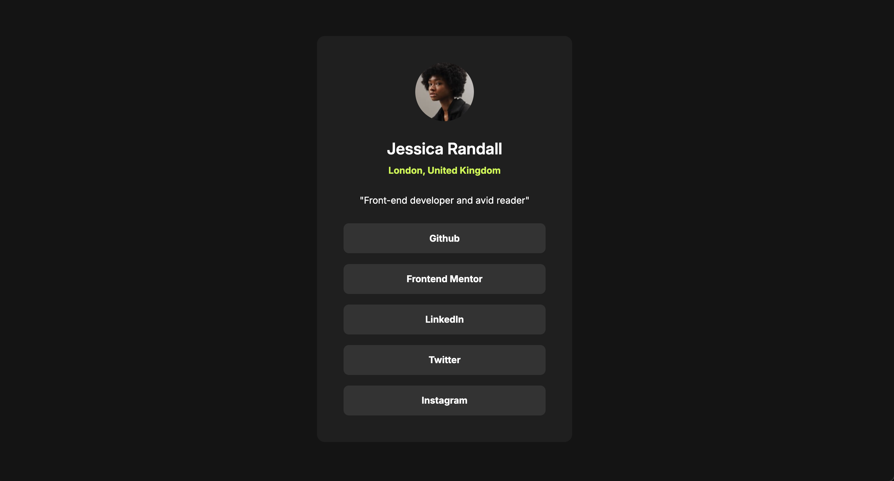

Challenge nr. 3 front Frontend Mentor

Had a bit of an issue with align-items:center, because it kept cropping the links to the smallest possible size. Didn't quite figure out why, but ended ut using margin:auto instead to center the links and keep the scaling fluid and responsive. 

Still really enjoying setting up all my variables up front and trying to keep the css to a minimum. Will get better eventually. 

QUESTIONS: 
1. Is it good semantic html to keep the <a> inside the 
?
2. How do i use the transition-property to make the background-color change back to grey smoothly? I apply the transition on my .primary-button, but the it transitions the entire button causing a layout-shift. 

Anywhoo, challenge complete I guess. 

